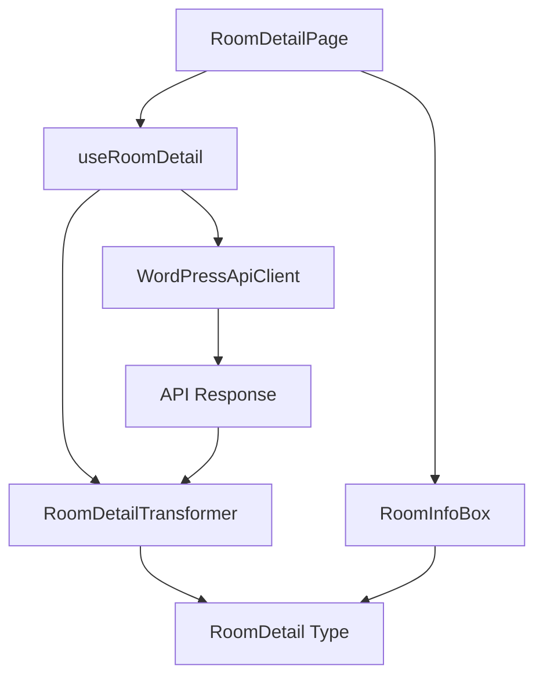

# 部屋詳細機能の実装計画

## 概要
部屋詳細情報を取得・表示するための機能を実装する。
既存の部屋一覧機能の実装パターンを参考に、同様のアーキテクチャで実装を行う。

## 依存関係

## 実装範囲

### 1. APIクライアント実装
- 場所: `src/api/wordpress.ts`
- タスク:
  - `getRoomDetails` メソッドの実装
  - エラーハンドリングの実装
  - レスポンス型の定義
- エラーケース:
  - ネットワークエラー
  - APIキー認証エラー
  - パラメータ不正
  - 存在しない部屋ID
  - レスポンス形式不正

### 2. データ変換ロジック実装
- 場所: `src/lib/room-detail/RoomDetail.ts`
- タスク:
  - APIレスポンスを表示用データに変換する関数の実装
  - 型定義の活用
- エラーケース:
  - 必須フィールド欠損
  - データ型不一致
  - 不正な日付形式

### 3. カスタムフック実装
- 場所: `src/hooks/room-detail/useRoomDetail.ts`
- タスク:
  - 部屋詳細データの取得・管理
  - ローディング状態の管理
  - エラーハンドリング
- 状態管理:
  - ローディング中
  - エラー発生
  - データ取得済み
  - 初期状態

### 4. UIコンポーネント実装
- 場所: `src/components/room-detail/room-info-box/room-info-box.tsx`
- タスク:
  - 部屋情報表示コンポーネントの実装
  - エラー表示の実装
  - ローディング表示の実装
- 表示状態:
  - ローディング中のスケルトン表示
  - エラーメッセージ表示
  - データなし表示
  - 正常表示

## 実装の流れ

1. APIクライアント実装
   - WordPressAPIクライアントに `getRoomDetails` メソッドを追加
   - エラーハンドリングを実装
   - 型定義を活用

2. データ変換ロジック実装
   - APIレスポンスを表示用データに変換する関数を実装
   - 型安全性を確保

3. カスタムフック実装
   - `useRoomDetail` フックを実装
   - 状態管理とエラーハンドリングを実装

4. UIコンポーネント実装
   - 部屋情報表示コンポーネントを実装
   - エラー・ローディング表示を実装

## テスト計画

### 1. APIクライアントテスト
- 正常系テスト
  - 正しいパラメータでのリクエスト
  - レスポンスの型チェック
- 異常系テスト
  - 不正なパラメータ
  - ネットワークエラー
  - 認証エラー

### 2. データ変換ロジックテスト
- 正常系テスト
  - 完全なデータの変換
  - 最小限のデータの変換
- 異常系テスト
  - 不正なデータ形式
  - 必須フィールド欠損

### 3. カスタムフックテスト
- 正常系テスト
  - データ取得フロー
  - 状態遷移
- 異常系テスト
  - エラーハンドリング
  - 再試行処理

### 4. UIコンポーネントテスト
- 表示テスト
  - 各状態での表示確認
  - レスポンシブ対応
- インタラクションテスト
  - エラー時の再試行
  - ローディング表示

## 注意点

- 既存の型定義（`RoomDetail`）を変更しない
- エラーハンドリングを適切に実装
- ローディング状態を適切に管理
- コンポーネントの再利用性を考慮
- 型安全性を確保

## 参考コード
- `useRoomsList.ts`
- `RoomList.ts`
- `room-list-box.tsx`
- `page.tsx` 